## Contents
- [Cache Run](#cache-run)
	- [Group Members](#group-members)
	- [Description](#description)
	- [Features](#features)
	- [Libraries](#libraries)
	- [Requirements](#requirements)
	- [Installation Notes](#installation-notes)
	- [Final Project Status](#final-project-status)
	    - [Minimum Functionality](#minimum-functionality)
    	- [Expected Functionality](#expected-functionality)
    	- [Bonus Functionality](#bonus-functionality)
    - [Code Examples](#code-examples)
    - [Functional Decomposition](#functional-decomposition)
    - [High-level Organization](#high-level-organization)
	- [Clickstreams](#clickstreams)

# CacheRun 

CacheRun is an immersive augment reality (AR) application that is a platform for vendors to advertise sales to customers. The application contains AR coupons from various vendors that users are able to travel around and collect. As the user enters the radius of a coupon, they can see how close they are to it. Once the user is close enough to the coupon it will appear on their screen in AR and the user can save it to their list of saved coupons. 

## Group members

| Name                   | Banner ID  | Email                    |
| ---------------------- | ---------- | ------------------------ |
| Kyle Burgess           | B00760561  | k.burgess@dal.ca         |
| Serena Drouillard      | B00705127  | serena.drouillard@dal.ca |
| William Devine         | B00123456  | wl856147@dal.ca          |

## Description

Coupons are an effective means of advertising and increasing sales. A popular means for a business to provide discounts are through "hurdle" promotions. This is similar to a compnay offering a mail-in rebate which provides the consumer a discount if they are willing to put the effort into taking advantage of it. 

CacheRun takes the idea of "hurdle" promotions to the streets. The app allows vendors to place AR coupons at set geo-locations. Each coupon placed features a distance threshold, once a user is within this radius they are able to display the coupon in AR and ultimately save the coupon to be used later. 

So then, CacheRun will provide benefits for both vendors, as they can advertise their sales and promotions, and consumers as they can reap the benefits of these sales and promotions.


### Users

Coupons are leveraged by all age groups, however, the CacheRun team is aware that an AR app may not be as appealing to older generations. As such, CacheRun's targeted age demographic is 18-40 year olds.

### Features

- Able to display coupons in the user's area
- Able to display the AR coupon once the user selects it
- Able to collect coupons that displayed in AR


## Libraries

**[ARCore:](https://developers.google.com/ar/develop/java/quickstart)** ARCore is a software development kit developed by Google that allows for augmented reality applications to be built.

**[Sceneform:](https://developers.google.com/ar/develop/java/sceneform/)** Sceneform makes it straightforward to render realistic 3D scenes in AR and non-AR apps, without having to learn OpenGL.


## Requirements

**Minimum Requirements**
- Android 8.0 (Android 10.0 is targeted)
- Camera Access
- Location Access

## Installation Notes

Only the included apk is reuired to run.

**Note:** The submitted version of CacheRun will feature coupons in the collection radius of the Goldberg Computer Science building. If testing/marking is performed elsewhere, [simply update the emulator's location](https://developer.android.com/studio/run/emulator#extended) or update the latitude and longitude of coupons in the code:

```kotlin
private fun buildCoupons() {
    piggyCoupon.hardCodedLocation.latitude= 44.673524
    piggyCoupon.hardCodedLocation.longitude = -63.614440
    availableCouponList.add(piggyCoupon)

    pizzaCoupon.hardCodedLocation.latitude= 44.673524
    pizzaCoupon.hardCodedLocation.longitude = -63.614440
    availableCouponList.add(pizzaCoupon)

    bookCoupon.hardCodedLocation.latitude= 44.673524
    bookCoupon.hardCodedLocation.longitude = -63.614440
    availableCouponList.add(bookCoupon)
}
```

## Final Project Status

The CacheRun team was successfully able to adhere to our timeline throughout the process. As such, the team was able to complete all of Minimum Functionallity and Expected Function. Bonus Functionality was completed save for one task. 

Unfortunately, not much time was able to be dedicated to UI/UX polish.

### Minimum Functionality
- Display hard-coded pins at a predetermined, hardcoded GPS location that are always visible to the user. (Completed)

### Expected Functionality
- Replace pins with 3D coupon models (Completed)
- Calculate distance from user to coupon (Completed)
- Once user is within range of coupon, the coupon becomes visible (Completed)
- User can collect displayed coupons
- Coupons that have been collected are added to list of collected coupons (Completed)
- Coupons that have been collected are removed from list of available coupons (Completed)

### Bonus Functionality
- Create a list of coupons that have been coded to display at specific GPS locations (Completed)
- Each coupon in the Available Coupons list displays that coupon's distance to the user (Completed)
- The user must click on displayed coupon to collect it (Completed)
- When coupons in the Collected Coupon list are clicked, that coupon's details are displayed (WIP)


## Code Examples

You will encounter roadblocks and problems while developing your project.
Share 2-3 'problems' that your team encountered.
Write a few sentences that describe your solution and provide a code snippet/block
that shows your solution. Example:

**Problem 1: Assigning Images to Coupons/their Cardview**

The team found it difficult to conceptualize passing images from a coupon to the RecyclerView card corresponding to that coupon.

```kotlin
// We added an integer parameter to the Coupon class's constructor.
// This integer is passed to the constructor using R.drawable.[NAME_OF_IMAGE]
data class Coupon(var name: String, val imageId: Int) {
    // {...}
}
```

```kotlin
// An array of coupons, called coupons, is passed to this class.
// This coupons array is iterated through, and at each iteration 
// the imageview associated with the current card of the RecylerView
// is set to the current coupon's image
override fun onBindViewHolder(holder: ViewHolder, position: Int) {
    // {...}
    holder.coupImg.setImageResource(coupons[position].imageId)
    // {...}
}
```

**Problem 2: Detecting when a user touches a displayed coupon (collecting a coupon)**

Once the user had displayed a coupon, the team needed to devise a method to collect that coupon. To provide this functionality, a onTouchListener was added to each coupon everytime a coupon was placed. Within this onTouchListener, the anchor, which is the parent node of the coupon node, gets removed from the AR scence. It is within this onTouchListner where coupons are removed from/added to the Available Coupons or Collected Coupons view.

```kotlin
transformableNode.setOnTouchListener { hitTestResult, motionEvent ->
	anchorNode.removeChild(transformableNode)
	collectCoupon(coupon)
	true
}

private fun collectCoupon(coupon: Coupon) {
	coupon.isDisplayed = false
	coupon.isCollected = true
	availableCouponList.remove(coupon)
	collectedCouponList.add(coupon)
}
```


## Functional Decomposition

**Coupon Model** 

Using a data class, this model stores infornmation about each coupon object. 

**Coupon Adaptor**

Assembles the RecyclerView and its cards. An array of coupons are passed to the adaptor and cards are built with information from the coupon's model. 

**AR and location logic**

All of CacheRun's logic for location services and AR are present in the Main Activity; the team would like to do a major refactor time allowing. 

## High-level Organization

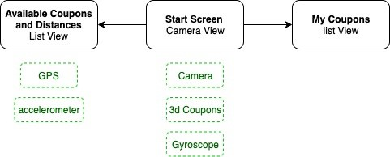

## Clickstreams

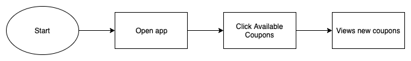
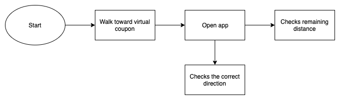
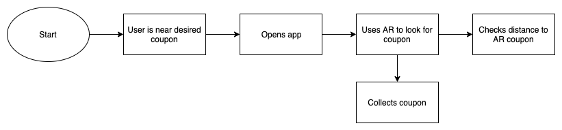
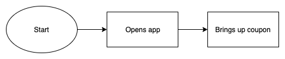


## Layout

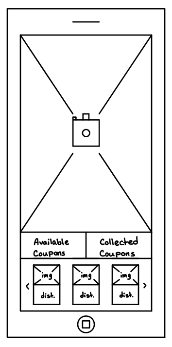

## Implementation

### Calibration

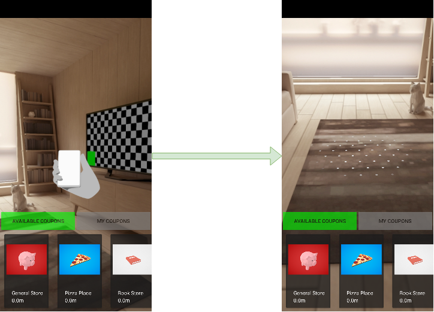

### Toggling from Available Coupons to Collected Coupons

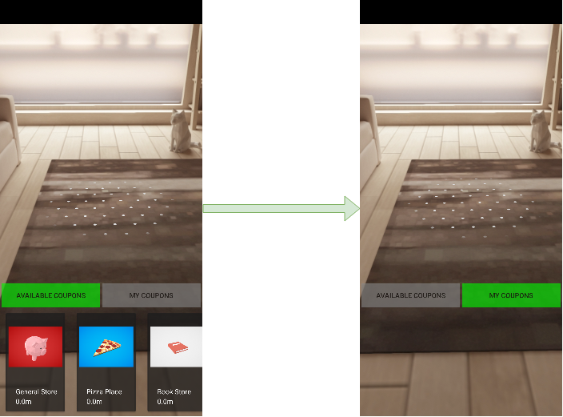

### Displaying a Coupon in AR

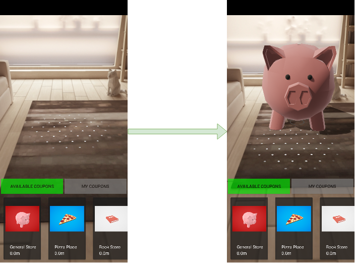

### Collecting an AR Coupon

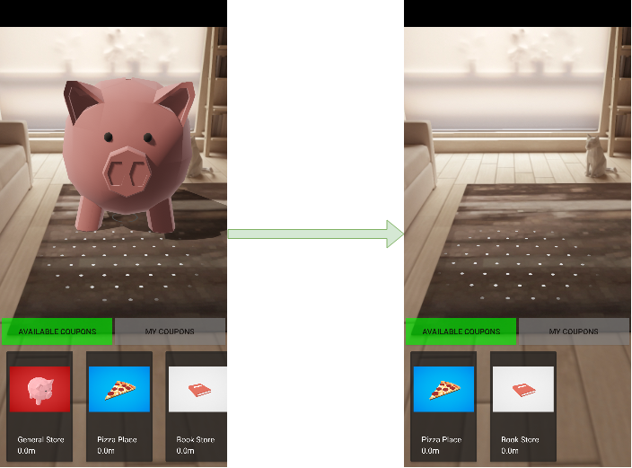

### Collected Coupons in Collected Coupons View

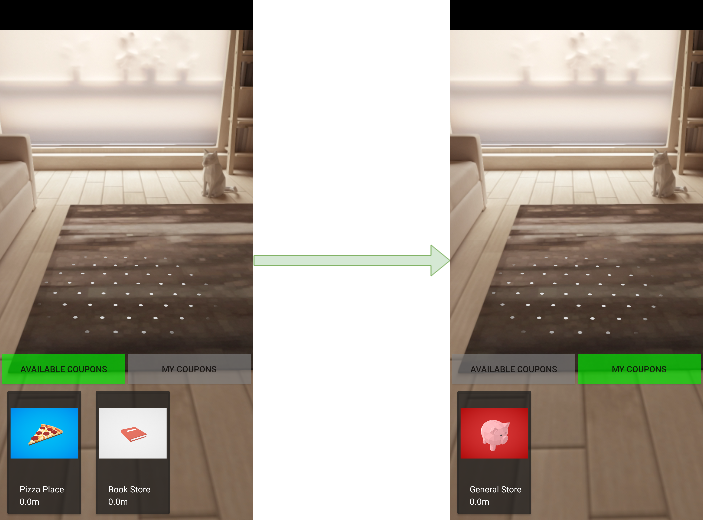


## Future Work

In order to have a complete application there would need to be more work; however, due to the time constraints of the academic semester not everything is able to be done.

To make our application complete there are some key features that would need to be added. These features include, but are not limited to: Adding user accounts, Map view with coupon markers, Firebase integration, and coupon management for vendors.

Adding the ability for users to create their account would enhance their experience by not needing to store all of their coupons to a single device. Accounts would allow the user to have their coupons regardless of which device they were on by linking them to their account. This would also allow for the integration of social media, which could be used share progression and analyse the users interest to better recommend coupons for them.

Having a map view would increase the users experience by giving them a better sense of where to go to obtain coupons that are relevant to their likes. Currently the users do not have a method to view all of the coupons that are available, only the ones in their radius which can lead to the user wandering around looking for blindly for coupons. Having the map view would solve this dilemma and encourage the users to go capture new coupons.

Integrating Firebase would resolve a few complications. For starters, Firebase could be used to store all of the data for coupons, vendors, users, and more. Storing data is a necessity for make this application usable on a large scale. If all of the data was stored locally, we would need to push out app updates too often which is just not efficient or reliable. Furthermore, Firebase has excellent build in user authentication, using OAuth2, which would negate the need for our team to manually encrypt passwords and authentication transmissions. 

Finally, a feature that would aid vendors would be to provide them with a separate account type that would allow them to create a vendor profile and add coupons to their profile. These coupons would then be posted on the map and available for coupons users to collect. Having this feature would eliminate the developers as a middleman, where the vendors would need to send in coupons to be published.


## Sources

- https://developers.google.com/ar/develop/java/quickstart
	“Quickstart for Android  |  ARCore  |  Google Developers,” Google. [Online]. Available: https://developers.google.com/ar/develop/java/quickstart. [Accessed: 01-Dec-2019].
- https://developers.google.com/ar/develop/java/sceneform
	“Sceneform overview  |  ARCore  |  Google Developers,” Google. [Online]. Available: https://developers.google.com/ar/develop/java/sceneform. [Accessed: 01-Dec-2019].
- https://developers.google.com/maps/documentation/android-sdk/intro
	Google. [Online]. Available: https://developers.google.com/maps/documentation/android-sdk/intro. [Accessed: 01-Dec-2019].
- Book Model: https://poly.google.com/view/4S1nr7WmUxm
	“Book,” Google. [Online]. Available: https://poly.google.com/view/4S1nr7WmUxm. [Accessed: 01-Dec-2019].
- Pizza Model: https://poly.google.com/view/cBF3cn9dz5p
	“Pepperoni pizza,” Google. [Online]. Available: https://poly.google.com/view/cBF3cn9dz5p. [Accessed: 01-Dec-2019].
- Piggy Bank Model: https://poly.google.com/view/dpvS2kdW6I9
	“Piggy bank,” Google. [Online]. Available: https://poly.google.com/view/dpvS2kdW6I9. [Accessed: 01-Dec-2019].
- https://www.youtube.com/watch?v=EFZkktBOFF8
	"Android Kotlin Horizontal RecyclerView Tutorial" YouTube. [Online]. Available: https://www.youtube.com/watch?v=EFZkktBOFF8. [Accessed: 01-Dec-2019].


